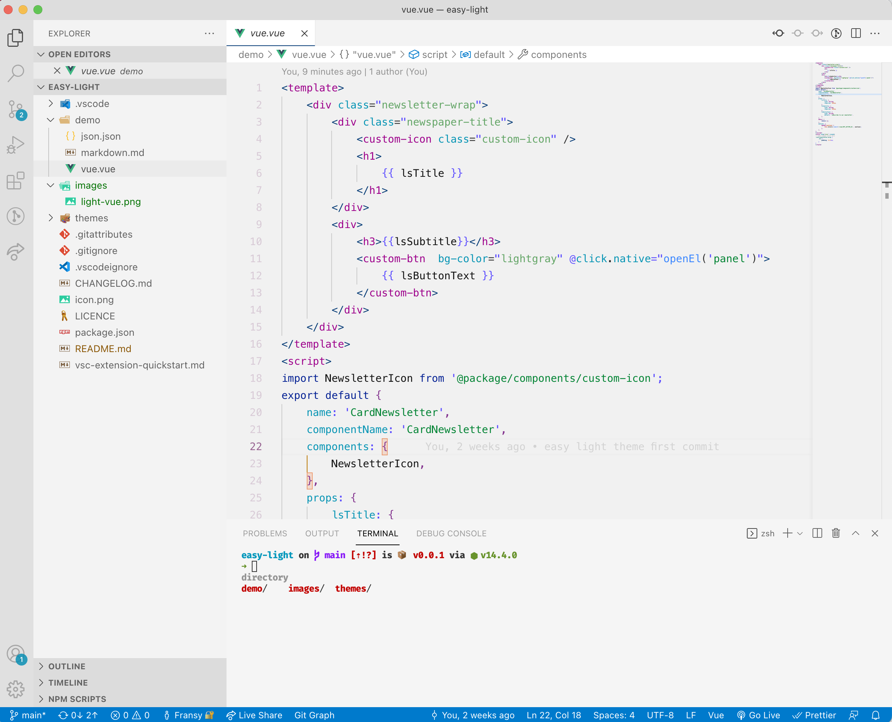

# Easy Light

Easy Light is a Visual Code theme for those who prefer light mode and avoid that halation effect.

> I personally like dark themes. However, there is a point in time when the  white letters appear to bleed into the black background

This theme tries to bring the "cool" stuff from dark themes and still be nice to eyes. 

## Examples
**Easy Light Vue**

## Installation

1. Go to [VS Marketplace](https://marketplace.visualstudio.com/items?itemName=fransyrcc.easy-light).
2. Click on the "Install" button.
3. [Select `Easy Light`](https://code.visualstudio.com/docs/getstarted/themes#_selecting-the-color-theme). 

## Feedback

This is my first try into creating a VS Code theme. 

If you have suggestions or see something that can be improved, please [open an issue](https://github.com/fransyrcc/easy-light-vscode-theme/issues) or better yet, create a [pull request](https://github.com/fransyrcc/easy-light-vscode-theme/pulls).

That would be awesome!
## Credits

This theme was inspired by:
- [Sarah Drasner](https://twitter.com/sarah_edo)'s [Night Owl theme - Light Owl](https://marketplace.visualstudio.com/items?itemName=sdras.night-owl)
- [Community Material Theme](https://marketplace.visualstudio.com/items?itemName=Equinusocio.vsc-community-material-theme)

